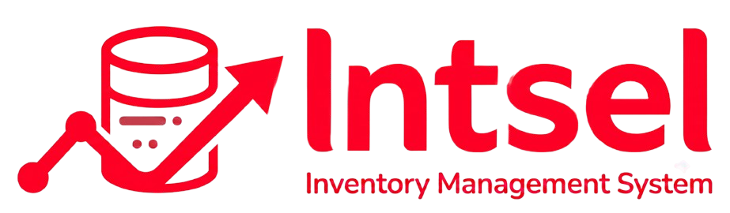
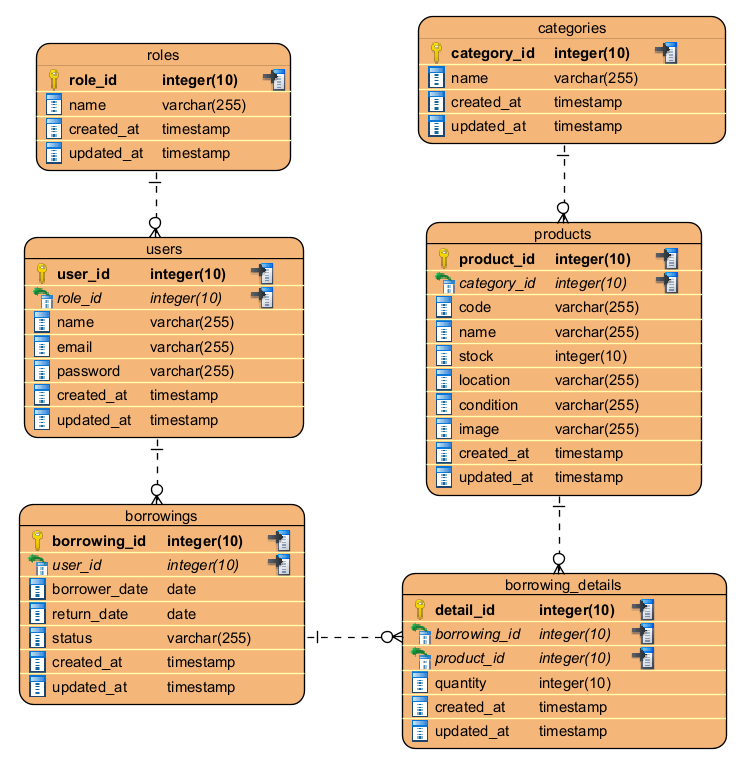

<div align="center">


    
# 📦 Intsel - Inventory Management System

<p align="center">
  
  
  
  
  
</p>


## 📖 Overview

**Intsel** adalah aplikasi web Inventory Management System yang dikembangkan untuk membantu pengelolaan inventaris perusahaan, mulai dari manajemen kategori, produk, transaksi peminjaman, hingga pengelolaan pengguna berdasarkan Role-Based Access Control (Admin, Staff, dan Manager). Aplikasi ini dibangun menggunakan **Laravel 12** dengan arsitektur **MVC (Model-View-Controller)**, **MySQL** sebagai basis data, **Blade** dan **Bootstrap (Star Admin Template)** untuk antarmuka pengguna, **Laravel Breeze** untuk autentikasi, **Spatie Laravel Permission** untuk manajemen hak akses, serta **Chart.js** untuk visualisasi data pada dashboard. Aplikasi dideploy menggunakan **Railway** sehingga dapat diakses secara online.

---
</div>

# 🚀 Live Demo

**Demo Application**

https://intsel-project-production.up.railway.app/

---

# ✨ Features

## Dashboard

- Total Products
- Borrowed Products
- Available Stock
- Monthly Borrowing Trends (Chart)
- Recent Borrowings
- Recently Added Products

---

## Authentication

- Login
- Logout
- Session Authentication
- Role-Based Access Control (RBAC)

---

## Category Management

- View Categories
- Add Category
- Edit Category
- Delete Category
- Export PDf & Excel
- Pagination

---

## Product Management

- View Products
- Add Product
- Edit Product
- Delete Product
- Upload Product Image
- Export PDf & Excel
- Pagination

---

## Borrowing Management

- Create Borrowing
- View Borrowing Detail
- Edit Borrowing
- Delete Borrowing
- Borrow Multiple Products
- Export PDf & Excel
- Update Borrowing Status

---

## User Management

- View Users
- Create User
- Edit User
- Delete User
- Assign User Role
- Export PDf & Excel

---

# 👥 User Roles

| Role | Access |
|------|--------|
| Admin | Full Access |
| Staff | Manage Categories, Products, Borrowings |
| Manager | Dashboard (Read Only) |

---

# 🛠 Tech Stack

## Backend

- Laravel 12
- PHP 8.2

## Frontend

- Blade Template Engine
- Bootstrap 5
- Star Admin Dashboard
- Chart.js
- JavaScript

## Database

- MySQL

## Authentication

- Laravel Breeze

## Authorization

- Spatie Laravel Permission

## Deployment

- Railway

---

# 📂 Project Structure

```
app/
├── Http/
│   ├── Controllers/
│   └── Middleware/
│
├── Models/
│
database/
├── migrations/
├── seeders/
│
resources/
├── views/
│
routes/
└── web.php
```
## ERD


---

# ⚙️ Installation

## 1. Clone Repository

```bash
git clone https://github.com/<username>/intsel-project.git
```

Masuk ke folder project

```bash
cd intsel-project
```

---

## 2. Install Dependency

```bash
composer install
```

Install Frontend Dependency

```bash
npm install
```

Build Assets

```bash
npm run build
```

atau

```bash
npm run dev
```

---

## 3. Copy Environment File

Windows

```bash
copy .env.example .env
```

Linux / Mac

```bash
cp .env.example .env
```

---

## 4. Generate Application Key

```bash
php artisan key:generate
```

---

## 5. Configure Database

Buka file

```
.env
```

Lalu sesuaikan konfigurasi database

```env
DB_CONNECTION=mysql
DB_HOST=127.0.0.1
DB_PORT=3307
DB_DATABASE=intsel_db
DB_USERNAME=root
DB_PASSWORD=
```

---

## 6. Run Migration

```bash
php artisan migrate
```

---

## 7. Seed Database

```bash
php artisan db:seed
```

atau

```bash
php artisan migrate:fresh --seed
```

---

## 8. Storage Link

```bash
php artisan storage:link
```

---

## 9. Run Application

```bash
php artisan serve
```

Buka browser

```
http://127.0.0.1:8000
```

---

# 🔐 Testing Account

## 👑 Admin

Email

```
admin@admin.telkomsel
```

Password

```
password
```

---

## 👨‍💼 Staff

Email

```
staff@staff.telkomsel
```

Password

```
password
```

---

## 📊 Manager

Email

```
manager@manager.telkomsel
```

Password

```
password
```

> Sesuaikan kembali jika email atau password pada `UserSeeder.php` berbeda.

---

# 🗄 Database

Database utama terdiri dari beberapa tabel berikut:

- users
- roles
- model_has_roles
- categories
- products
- borrowings
- borrowing_details

---

# 📈 Dashboard Metrics

Dashboard menampilkan beberapa informasi utama:

- Total Products
- Borrowed Products
- Available Stock
- Monthly Borrowing Trends
- Recent Borrowings
- Recently Added Products

---

# 📄 License

This project was developed for the **Technical Challenge**.

---

# 👨‍💻 Author

**Arsya Nueva Delavera**

Information Systems Student

Institut Teknologi Sepuluh Nopember (ITS)

GitHub: https://github.com/arsyanueva

